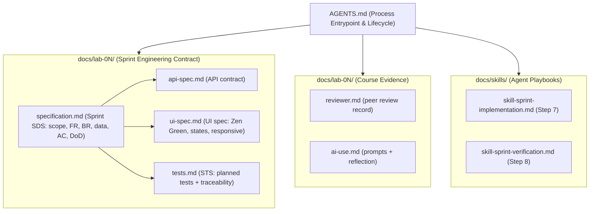
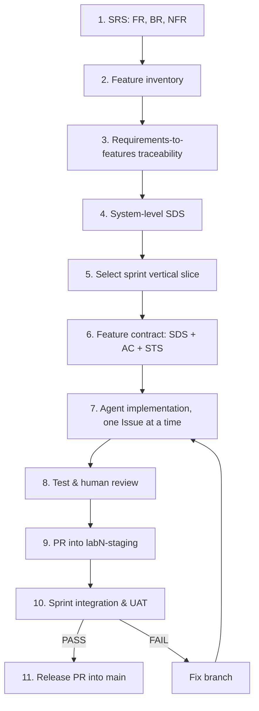

# AGENTS.md — TokTickIT

Process entrypoint for AI agents working in this repository.
**อ่านไฟล์นี้ก่อนแก้โค้ดทุกครั้ง** — it defines the lifecycle, the contract
files, the work norms, and the conventions that keep sprints consistent.

**Project:** TokTickIT — an IT service desk built for CPE 334 (KMUTT) across
four individual sprints (Labs 1–4).
**Author:** Naphat Utabuawong (67070501015, @AlphabetCG)
**Peer reviewer:** Nantakorn Pinsupaporn (67070501028, @copter549365) — partner
repo `copter549365/toktickit`; review runs in both directions every lab.

```
React + TypeScript + Vite + Bootstrap  (client)
        → Node + Express + TypeScript  (server)
        → Prisma ORM → PostgreSQL       (database)
        → Vitest + Supertest + Playwright (tests)
```

**Fixed stack — never substitute** the framework, database, ORM, UI library, or
test runners.

---

## 1. Documentation Directory & SDD Mapping

Every contract file and its role in the Spec-Driven Development lifecycle. Read
the contract before writing code; the current lab's `docs/lab-0N/` directory is
the authority for that sprint.

| Relative Path | SDD Component / Stage | What the File Does |
| :--- | :--- | :--- |
| **`AGENTS.md`** | **Process entrypoint & lifecycle** | This file: lifecycle, agent roles, work norms, conventions. |
| **`README.md`** | **Setup & run guide** | Install, database provisioning, dev servers, test commands. |
| **`docs/lab-02/specification.md`** | **Sprint SDS** (Steps 4–6) | Scope, FR, BR, data model, API contract, acceptance criteria, Definition of Done. |
| **`docs/lab-02/api-spec.md`** | **API contract** (Step 6) | Endpoint paths, request/response shapes, statuses, error semantics. |
| **`docs/lab-02/ui-spec.md`** | **UI design specification** (Steps 4/6) | Zen Green tokens, component states, responsive rules, visual checklist. |
| **`docs/lab-02/tests.md`** | **Software Test Spec (STS)** (Steps 6/8) | Planned-test table, AC traceability, commands, final results. |
| **`docs/lab-02/reviewer.md`** | **Peer review record** | Reviewer identity, PR links, comments exchanged, approvals. |
| **`docs/lab-02/ai-use.md`** | **AI use & reflection** | LLM used, 6–10 key prompts, decomposed sub-agent tasks, reflection. |
| **`docs/skills/skill-sprint-implementation.md`** | **Construction playbook** (Step 7) | Build order for the Builder Agent implementing one Issue. |
| **`docs/skills/skill-sprint-verification.md`** | **QA & verification playbook** (Step 8) | Test, review, and visual-drift checklist before claiming done. |
| **Lab sheet PDF** (not in repo) | **SRS** (Steps 1–3) | Issued per lab. When attached to a session it is the requirements of record. |



---

## 2. The SDD & Engineering Contract Lifecycle



### Phase 1 — Planning & design (human / spec agent)
Steps 1–4 arrive with the lab sheet: requirements, feature list, and the fixed
architecture above.

### Phase 2 — Sprint scoping (human-led)
Steps 5–6. **The contract is written before any code.** One GitHub Issue per
bounded unit of work, each carrying its own acceptance criteria, opened before
implementation begins.

### Phase 3 — Construction & verification (Builder Agent)
Steps 7–9. One Issue → one feature branch → failing tests → smallest correct
implementation → green tests → PR into the staging branch → peer approval →
merge. Follow `docs/skills/skill-sprint-implementation.md`.

### Phase 4 — Release
Steps 10–11. Full suite green on staging, then one release PR from
`labN-staging` into `main`.

### Kanban
GitHub Project **"TokTickIT Individual Sprints"**, columns in this exact order:

```
Backlog → Specified → Started → PR Review → Fixing → Done
```

**Only one card may sit in Started at a time.**

---

## 3. Agent Roles & Multi-Agent Delegation

Default to a single agent. Delegate only when the user asks for it.

* **Builder Agent** — consumes the contract files and implements one bounded
  Issue. Follows `docs/skills/skill-sprint-implementation.md`.
* **Spec Auditor (sub-agent)** — loads only `specification.md` plus the diff, and
  reports where the implementation departs from the contract.
* **Style Auditor (sub-agent)** — loads only `ui-spec.md` plus the changed UI
  files, and checks token compliance, component states, and responsive rules.
* **Test Authoring (sub-agent)** — reads `specification.md` and `tests.md` and
  writes or updates test files under `*/tests/lab-0N/` and `e2e/lab-0N/`.
* **Reviewer Agent** — reads the partner's PR and drafts substantive review
  comments tied to acceptance criteria.

Record the decomposed sub-agent prompts in `docs/lab-0N/ai-use.md`; prompt
quality and reflection are graded.

---

## 4. Developer Work Norms

* **Strict closed-world rule.** If the specification is silent on a design
  choice, **stop and ask the user**. Never fabricate a business rule, invent a
  field, or widen scope to fill a gap.
* **Spec- and test-driven.** No feature is complete without an automated test
  that traces to a numbered acceptance criterion. Write the failing test first,
  confirm it fails for the expected reason, then implement.
* **Evidence over assertion.** "Done" means the acceptance criteria are
  satisfied and the tests pass. Never report completion when tests are missing,
  skipped, `.todo`, flaky, or unrelated to the criteria they claim to cover.
* **State what you completed.** Name the acceptance criteria and tests covered
  by the change, and name what remains.
* **Explainability.** The student must be able to explain every committed line
  and demonstrate the failure cases. Prefer the smallest change that satisfies
  the criterion; delete code that adds no behaviour rather than leaving it.
* **Theme compliance.** UI work uses the Zen Green tokens declared in
  `ui-spec.md` as CSS variables. Do not hardcode hex values in components and do
  not reach for raw Bootstrap colour utilities where a token exists.
* **Never guess credentials.** On a database authentication failure, ask. Do not
  brute-force or try candidate passwords.
* **Commit and push only when the user asks.**
* **Prompt for evidence.** Graded evidence is perishable — a state that exists
  only while a branch is unmerged or a card sits mid-board cannot be
  reconstructed later. At every milestone below, **tell the user what to capture
  before moving on**. Never assume they will remember, and never let a milestone
  pass silently.

### 4.1 Evidence capture points

The submission PDF answers Parts 1–9. Evidence is captured at the moment the
state exists, not rebuilt at the end of the sprint.

| Milestone | Remind the user to capture | Part |
|-----------|---------------------------|------|
| Contract committed, before any implementation PR | The commit list for the specification branch **showing its dates** — this is the only proof the spec preceded the code, and it is unrecoverable once implementation starts | 2 |
| Any PR opened | The PR page while still open, showing the base is the staging branch | 1 |
| Issues created | The Issue list while the Issues are still open | 1 |
| Kanban mid-sprint | The board while cards are spread across columns — at the end everything sits in Done and the movement is invisible | 1 |
| Peer review exchanged | The reviewer's comment, the author's reply, and the approval badge — **in both directions** | 1 |
| A screen reaches a new state | That state: initial, loading, validation failure, submitting, success, API failure, empty, no-results | 6, 7, 8 |
| Ownership enforced | The refusal when the wrong Requester requests a resource, taken from a direct API call, not the UI | 7, 8 |
| Responsive pass | Desktop, tablet, and mobile for every screen, into `artifacts/lab-0N/screenshots/` | 9 |
| Sprint merged to `main` | Commit history showing feature → staging → main; Kanban with every Issue in Done; the full test suite passing **on `main`** | 1, 3 |

When a state is destructive to reproduce — a stopped backend, a failed upload, a
seeded-then-removed attachment — say so explicitly and capture it before
restoring normal operation.

---

## 5. Repository Layout

```
toktickit/
├── client/                      # React + TS + Vite + Bootstrap
│   ├── src/                     # App, screens, components, api client
│   ├── tests/lab-01/            # Lab 1 Vitest UI tests
│   ├── tests/lab-02/            # Lab 2 Vitest UI tests
│   ├── vite.config.ts           # pure Vite (plugins, server) — NO `test` key
│   └── vitest.config.ts         # Vitest `test` config lives here
├── server/                      # Express + TS (ESM)
│   ├── src/                     # app.ts (exports app, no listen), index.ts, prisma.ts
│   ├── prisma/                  # schema.prisma, seed.ts, migrations/
│   ├── tests/lab-01/            # Lab 1 Vitest + Supertest
│   ├── tests/lab-02/            # Lab 2 Vitest + Supertest
│   └── uploads/                 # attachment storage — gitignored
├── e2e/lab-02/                  # Playwright end-to-end specs
├── artifacts/lab-02/screenshots/ # responsive evidence: desktop/tablet/mobile
├── docs/
│   ├── lab-01/                  # Lab 1 contract + evidence
│   ├── lab-02/                  # Lab 2 contract + evidence
│   └── skills/                  # agent playbooks
├── .gitignore
├── README.md
└── AGENTS.md                    # this file
```

---

## 6. Commands

Run inside `client/` or `server/` unless stated otherwise.

| Task | Command |
|------|---------|
| Dev — backend | `cd server && npm run dev` (http://localhost:3000) |
| Dev — frontend | `cd client && npm run dev` (http://localhost:5173) |
| Test | `npm test` (Vitest; `vitest run`) |
| Typecheck | `npx tsc --noEmit` |
| Build | `npm run build` |
| Prisma migrate | `cd server && npm run prisma:migrate` |
| Prisma seed | `cd server && npm run prisma:seed` |
| E2E | `npx playwright test` (repo root) |

> Windows + PowerShell chains with `;`, not `&&`. A Bash tool is also available
> for POSIX scripts.

---

## 7. Database Setup (required for server tests)

Server tests need a migrated and seeded PostgreSQL. The app connects as role
**`toktickit`** / password **`toktickit`**, matching `server/.env.example`; the
real value lives in `server/.env`, which is gitignored.

On a fresh machine, create the database once as the postgres superuser
(`C:\Program Files\PostgreSQL\18\bin\psql.exe`):

```sql
CREATE ROLE toktickit WITH LOGIN PASSWORD 'toktickit' CREATEDB;
CREATE DATABASE toktickit OWNER toktickit;
```

Then `cp .env.example .env` → `npm run prisma:migrate` → `npm run prisma:seed`.
`CREATEDB` is required for Prisma's shadow database. Seeds upsert on natural
keys, so they are safe to re-run.

> On `P1000` the role or password is wrong — **ask the user**, do not guess. A
> forgotten superuser password can be reset via the `pg_hba.conf` `trust` toggle
> plus a service restart in an elevated shell.

---

## 8. Git Workflow

- `main` is the stable release branch. `labN-staging` is that sprint's
  integration branch.
- **Never develop directly on `main` or a staging branch.**
- One feature branch per Issue. PRs target the staging branch — GitHub defaults
  the base to `main`, so **change the base every time**.
- **Branch off staging only after the previous Issue has merged.** Branching too
  early yields an empty tree with no foundation to build on.
- **GitHub Issue numbers drift from lab Issue numbers** because pull requests
  consume the same counter. Run `gh issue list` before writing `Closes #N`.
- Peer review is mandatory and runs **both directions**, each with a substantive
  comment and a reply. A bare Approve does not satisfy the rubric. Record links
  in `docs/lab-0N/reviewer.md`.
- Commit trailer: `Co-Authored-By: Claude <model> <noreply@anthropic.com>`,
  naming the model that actually did the work.

---

## 9. Conventions & Gotchas

- **ESM everywhere.** Both `client` and `server` are `"type": "module"`. Use
  `.js` import specifiers in TypeScript (`import { app } from "./app.js"`) —
  Node ESM requires the post-compile extension at runtime.
- **Split Vite/Vitest config on the client.** The `test` key must live in
  `vitest.config.ts`, never `vite.config.ts`: the app runs Vite 6 while Vitest
  bundles Vite 5, so the `test`-key augmentation does not apply. Keep them apart.
- **`app.ts` exports the Express app without `listen()`** so Supertest can import
  it; `index.ts` owns the `listen`. Do not merge these files.
- **Prisma is lazy** — `getPrisma()` in `src/prisma.ts` opens the connection on
  first use, so DB-free routes and tests never touch PostgreSQL.
- **Tests live in `*/tests/lab-0N/`**, E2E in `e2e/lab-0N/`, screenshots in
  `artifacts/lab-0N/screenshots/`.
- **Never commit `.env`** — only `.env.example` is tracked. Verify with
  `git check-ignore .env`.
- **Never commit `node_modules/`, `server/uploads/`, or a stray root lockfile.**
  `package-lock.json` belongs in `client/` and `server/` only.
- **Ownership is a backend concern.** Hiding a control in the UI is never the
  protection. Every ticket and attachment route re-checks the requester.
- Keep `ai-use.md` and `tests.md` current as prompts and tests change.

---

## 10. Current Status

| Lab | State | Branch |
|-----|-------|--------|
| Lab 1 — foundation, health check, category seed, category list | **complete, merged to `main`** | `lab1-staging` |
| Lab 2 — Requester Ticketing MVP + Zen Green UI | **specification in progress** | `lab2-staging` |
| Lab 3 — authentication and roles | not started | — |
| Lab 4 — not yet released | not started | — |

**Lab 1 endpoints in production on `main`:** `GET /api/health` →
`{status:"ok",service:"TokTickIT API"}`; `GET /api/categories` → the four seeded
categories in id order. Tests green: server 4/4, client 4/4.

**Lab 2 next steps:** finish `api-spec.md`, `ui-spec.md`, and `tests.md`; open
the remaining Issues; then implement in dependency order —
Development Requester context → Ticket creation → My Tickets → Ticket Detail and
attachments → E2E and visual evidence.
